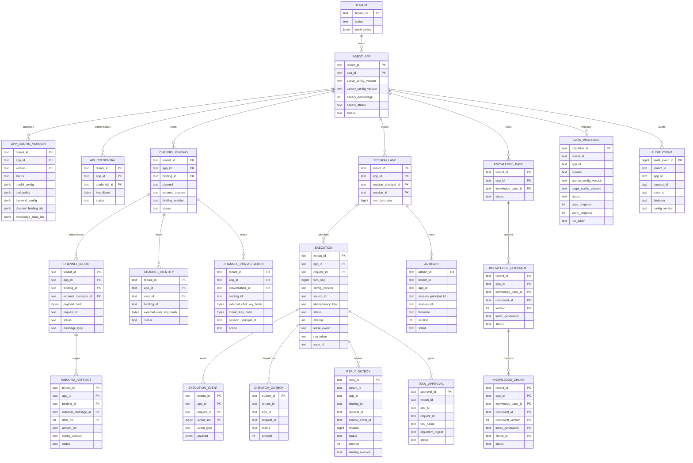

# 数据模型

本模型按当前 `trpcservice/postgres/migrations/000001_platform.sql` 到 `000016_inbound_artifact_upload_lease.sql`、Go model 和 framework resolver 整理。SQL 是平台控制面和执行状态的权威来源；Session 内容、向量、对象和 Memory 内容分别由真实配置选中的 framework/外部 Backend 持有。

## 实体关系

图中的关系分为两类：带 PostgreSQL foreign key 的硬关系，和由 `AppConfig` JSON 引用、framework service 或外部 Provider 形成的逻辑关系。`memory` 和 `summary` 没有平台独立表，这是实现事实，不是遗漏。

## 核心实体和权威性

| 实体 | 作用 | 作用域/authority | 关键状态或约束 |
| --- | --- | --- | --- |
| `tenant` | 租户生命周期和租户级审计上限 | PostgreSQL `platform.tenant` | `ACTIVE`/`SUSPENDED`；app 审计策略不能突破租户策略 |
| `agent_app` | 一个租户下的 Agent 应用和 stable/canary 指针 | PostgreSQL | PK `(tenant_id, app_id)`；active config FK；canary 状态/比例有 CHECK |
| `app_config_version` | 模型、工具、IM access、Backend、审计和引用集合 | PostgreSQL；版本不可变 | PK `(tenant, app, version)`；发布后不能 UPDATE/DELETE |
| `api_credential` | HTTP data-plane 认证凭据元数据 | PostgreSQL 保存 SHA-256 digest | digest 唯一；`REVOKED` 不能重新激活；raw key 只返回一次 |
| `channel_binding` | IM 账号和租户/app 的绑定 | PostgreSQL | PK `(tenant, app, binding)`；`binding_revision` 由字段变更触发递增；public route（legacy）全局唯一 |
| `channel_identity` | binding-scoped 外部用户到内部 `user_id` 的稳定映射 | PostgreSQL | 外部 user 只存 HMAC digest；digest 在 binding 内唯一；provider target 为 AEAD envelope |
| `channel_conversation` | 群聊/topic 到 conversation/session principal 的映射 | PostgreSQL | chat/thread digest 在 binding 内唯一；scope 为 `group`/`topic` |
| `channel_inbox` | IM message 去重、拒绝记录和 reply target | PostgreSQL | PK `(tenant, app, binding, external_message_id)`；payload hash 冲突即拒绝；`ADMITTED`/`REJECTED` |
| `session_lane` | 平台侧 Session 顺序分配器 | PostgreSQL | PK `(tenant, app, principal, session)`；`next_turn_seq > 0` |
| framework Session | event、state、tracks、summary 和 framework Session identity | 配置选中的 Redis/PostgreSQL/InMemory service | InMemory 只用于 local/test；平台不复制一份内容表 |
| `execution` | 一次已 Admission 的执行命令、租约和终态 | PostgreSQL | PK `(tenant, app, request_id)`；幂等唯一键；turn 唯一键；active lane index；`PENDING/RUNNING/WAITING_APPROVAL/SUCCEEDED/FAILED/CANCELED/UNCERTAIN` |
| `execution_event` | Runner 事件持久化和 resume 序列 | PostgreSQL | PK `(tenant, app, request, event_seq)`；序号单调递增 |
| `dispatch_outbox` | execution 到 Redis Stream 的可靠发布中继 | PostgreSQL | `PENDING/PUBLISHING/SENT/CONSUMED`；Relay claim 后发布；不能替代 execution |
| `reply_outbox` | Runner 完成后的 IM 回复投递队列 | PostgreSQL | `(binding, request, source_event, revision)` 唯一；`PENDING/SENDING/SENT/PERMANENTLY_FAILED/UNCERTAIN`；独立 lease/attempt |
| `tool_approval` | 危险工具的人工决策 | PostgreSQL | exact request/session/tool/argument digest；同一 context 只能有一个 pending |
| `artifact` | Session artifact 元数据和对象生命周期 | SQL metadata + COS object | session/filename/version 唯一；`PENDING/AVAILABLE/DELETED`；cleanup attempt/lease/completed |
| `inbound_artifact` | IM 入站对象 staging、Admission attach 和清理 | SQL metadata + COS object | message/item PK，artifact ref 唯一；`UPLOADING/PENDING/ATTACHED/DELETED`；上传租约/cleanup 字段 |
| `knowledge_base/document/chunk` | Qdrant 向量的 SQL 授权目录 | PostgreSQL catalog；向量内容在 Qdrant | base/document/chunk 复合 PK；status 和 `index_generation`；配置只能引用同 scope KB |
| `data_migration` | Session/Knowledge drain-copy-verify 状态机 | PostgreSQL | 每 app 一个 active migration；lease/run token/checkpoint；成功才切 active config |
| `audit_event` | metadata-only 执行和控制面审计 | PostgreSQL | scope、actor、request、trace、decision、latency、error、token/cost；无 prompt/tool args/secret |
| `worker_heartbeat` | Worker readiness、并发容量和最近错误 | PostgreSQL | Worker ID PK；`READY/NOT_READY`；TTL 过期不计入健康 worker |
| `schema_migration` | migrations checksum 和版本一致性 | PostgreSQL | advisory lock；已应用版本 checksum 必须匹配 |

## Session、Memory、Summary 的关系

一个平台 `execution` 通过 `(tenant_id, app_id, session_principal_id, session_id)` 指向 `session_lane`，并用 ConfigVersion 选择 framework Session resolver。对于 PostgreSQL Session，resolver 使用配置的 schema（默认 `agent`）；对于 Redis Session，resolver 使用 framework Redis service。两者都由 `session.Router` 按 provider 选择，平台的 Redis session lease 负责跨节点串行，而不是让 provider 自己解决 runner 并发。

framework Session 中的 event/state/tracks/summary 是实际上下文 authority。平台 `execution_event` 是对外 resume、审计和回复投影所需的 Runner event journal，不等价于 framework transcript。Memory 是 TencentDB 外部服务的 ingestor：平台不保存 Memory 内容表，只保存配置/secret 引用；私聊 key 包含 scope/user/session，群聊当前跳过归因写入。Summary 同样随 Session backend 保存，Redis→PostgreSQL migration 会显式复制并校验 summary。

## 配置、执行和回复的关系

Admission 将 `config_version` 固化到 execution，并通过 FK 保证该版本仍存在。执行期间模型/工具/Session/Knowledge/Artifact resolver 都从该版本选择。Runner 事件落入 `execution_event` 后，journal 在同一事务里可创建 `reply_outbox`；Reply Sender 只消费持久回复，不重新执行 Runner。这样请求结果、事件 resume 和 IM 发送有清晰 authority，但 Provider 发送本身仍可能是 uncertain。

## 约束边界

- `AppConfig` 里的 `BackendRef` 是选择契约，不代表 PostgreSQL schema 为每种 provider 自动创建适配。可用 provider 见[后端适配](backend-adaptation.md)。
- `channel_binding` 的 secret 是 `SecretRef`，不是 secret 值；channel identity/conversation 的 provider target 是密文，不是可检索的明文外部 ID。
- SQL catalog 负责 Knowledge 的 tenant/app/config/KB 授权；Qdrant collection/point 不能单独成为权限来源。
- artifact object 删除和 metadata 状态变更不是同一外部原子事务；cleanup 用可恢复 candidate/lease/attempt 处理“对象已删、状态未更新”或反向异常。
