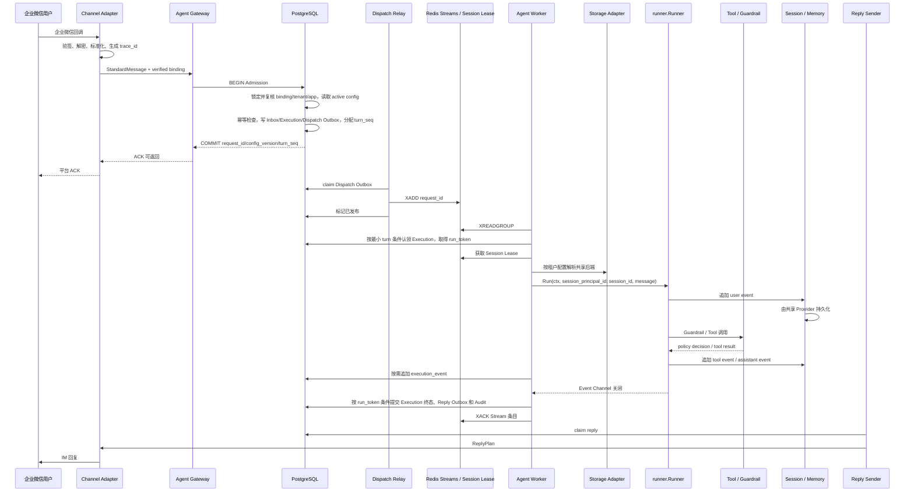
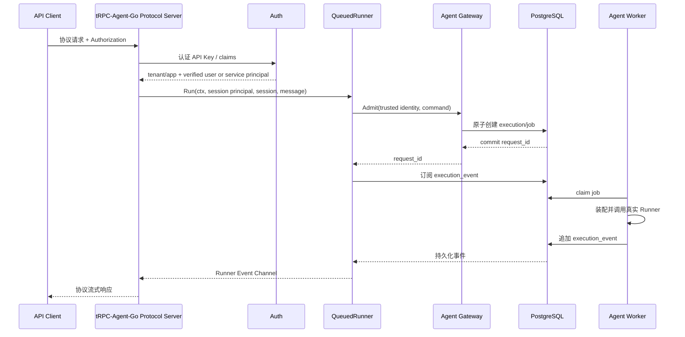

# 核心时序与 Trace 链路

## 1. 企业微信消息时序



Admission 事务提交是请求被平台接受的线性化点；同一事务写入 Execution 与 Dispatch Outbox。HTTP/RPC 使用认证主体和 client idempotency key 去重：内容相同的重试返回原 `request_id`，内容冲突直接拒绝。终端用户身份必须来自验证后的 claims 或内部 RPC 身份；仅带 API Key 的调用固定归属到该 Credential 的服务主体，不能通过 payload 指定其他 `user_id` 或 `session_principal_id`。配置切换事务更新同一 Agent App 行：配置切换先提交时 Execution 使用新版本，Admission 先提交时固定旧版本；权威数据后端变更只能通过 `MIGRATING` 切换。Redis Session Lease 失效会取消旧 Runner；本方案不提供严格的旧 Session 写入拒绝。

飞书使用相同平台时序，差异由 Channel Adapter 处理其入站校验、限流和回复协议。

## 2. HTTP/RPC 排队执行



协议 Server 只持有 QueuedRunner，不能绕过 Gateway 直接调用真实 Runner。OpenAI-compatible、AG-UI 和 tRPC-Agent 可以把连接取消传播为 Job 取消；A2A Task 默认与连接解耦，使用共享 TaskManager，仅显式 cancel 才取消。持久化 `execution_event` 支持跨节点返回和断线恢复，进程内 channel 只负责当前订阅生命周期。

## 3. trace_id 与 request_id

`trace_id` 用于跨组件观测，`request_id` 用于一次业务请求的幂等和状态追踪。

```text
Channel Adapter / HTTP-RPC Entry
-> 生成或继承 trace_id
-> Gateway 写入 request_id
-> Job 携带 trace_id + request_id
-> Worker 传入 Runner Context
-> Tool、Session、Memory、Reply Outbox 继续携带
-> Telemetry Collector 按 trace_id 汇聚
```

IM 请求通常由 Channel Adapter 创建 `trace_id`。HTTP/RPC 请求可以继承上游 trace，也可以由协议入口创建。异步步骤之间使用子 span 或 span link，把 Gateway 入队、Worker 执行和 Reply Outbox 发送串起来。

`request_id` 在 Gateway 生成或由可信客户端提供。入站幂等、execution 状态、Reply Outbox 和审计日志都记录它，重复请求可以返回原执行状态或原回复结果。

## 4. Event Channel 处理

Worker 调用 Runner 后必须持续消费 Event Channel，直到 channel 关闭。即使 `context.Context` 被取消，也要继续排空已产生的事件，避免 goroutine 泄漏和执行状态丢失。

Runner 完成后，Worker 使用当前 `run_token` 在 PostgreSQL 条件更新 Execution 终态并写必要 Audit；条件更新失败时不能覆盖新运行者。启用流式响应或断线恢复的协议入口写入 Execution Event Journal。Dispatch Outbox 负责 PostgreSQL 到 Redis 的至少一次发布；IM Reply Outbox 在实际 IM Adapter 接入时实现。Outbox 不参与 Session 写权限判断。

## 5. 危险 Tool 审批

```text
Runner 请求危险 Tool
-> 持久化原始 tool_call_id 对应的 Tool 调用和 tool_approval（精确参数密文、摘要、过期时间）
-> 同一 Execution 进入后续审批状态，内存中的 Runner 停止
-> 用户或授权管理员确认
-> 校验审批未过期、未使用且参数摘要一致
-> Tool Executor 条件领取 APPROVED 状态，并取得 Redis Session Lease
-> 使用保存的精确参数执行一次 Tool 调用
-> 以 approval_id 幂等写入相同 tool_call_id 的 tool_result Event 和 Audit
-> Execution 回到可调度状态，由新启动的 Runner 继续该轮
```

Runner 不在内存中等待人工确认，也不在确认后让模型重新生成参数。确认后 Worker 必须以 `WHERE status = APPROVED` 原子更新为 `EXECUTING` 来领取执行权；只有领取成功者执行。等待审批的 Job 阻止同一 Session 的后续 turn claim；Tool Executor 使用 Redis Session Lease 串行化实际调用。拒绝、过期或可确认失败也写入结构化 `tool_result` 后恢复该 Job。若结果已写入、但 Job 尚未恢复，恢复器重复写入同一 `approval_id` 不会产生第二个结果，再条件更新 Job。结果未知标记为 `UNKNOWN`，非幂等 Tool 不自动重试，Job 和同一 Session 的后续 turn 保持等待，直到人工记录处置结果。本方案不为审批额外引入 Session 写入 Fence，仍适用普通 Runner 的迟到写入残余风险。
