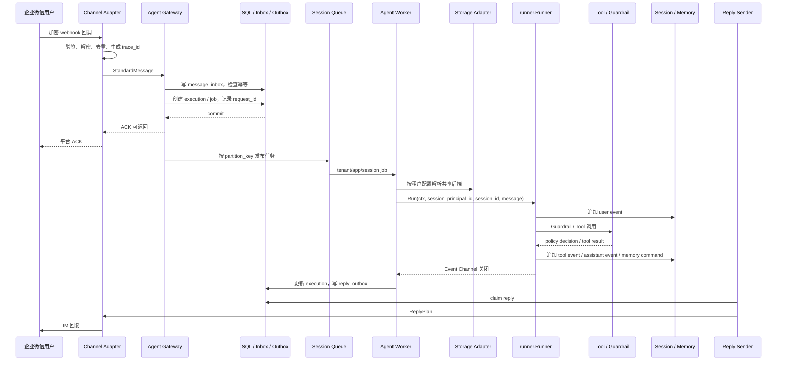

# 核心时序与 Trace 链路

## 1. 企业微信消息时序



## 2. trace_id 与 request_id

`trace_id` 用于跨组件观测，`request_id` 用于一次业务请求的幂等和状态追踪。

```text
Channel Adapter / HTTP-RPC Entry
-> 生成或继承 trace_id
-> Gateway 写入 request_id
-> Job 携带 trace_id + request_id
-> Worker 传入 Runner Context
-> Tool、Session、Memory、Reply Outbox 继续携带
-> Telemetry Collector 按 trace_id 汇聚
```

IM 请求通常由 Channel Adapter 创建 `trace_id`。HTTP/RPC 请求可以继承上游 trace，也可以由协议入口创建。异步步骤之间使用子 span 或 span link，把 Gateway 入队、Worker 执行和 Reply Outbox 发送串起来。

`request_id` 在 Gateway 生成或由可信客户端提供。入站幂等、execution 状态、Reply Outbox 和审计日志都记录它，重复请求可以返回原执行状态或原回复结果。

## 3. Event Channel 处理

Worker 调用 Runner 后必须持续消费 Event Channel，直到 channel 关闭。即使 `context.Context` 被取消，也要继续排空已产生的事件，避免 goroutine 泄漏和执行状态丢失。

Runner 完成后，Worker 更新 execution 状态，并把最终回复写入 Reply Outbox。发送失败不回滚 Runner 执行结果，由 Reply Outbox 负责退避重试。
