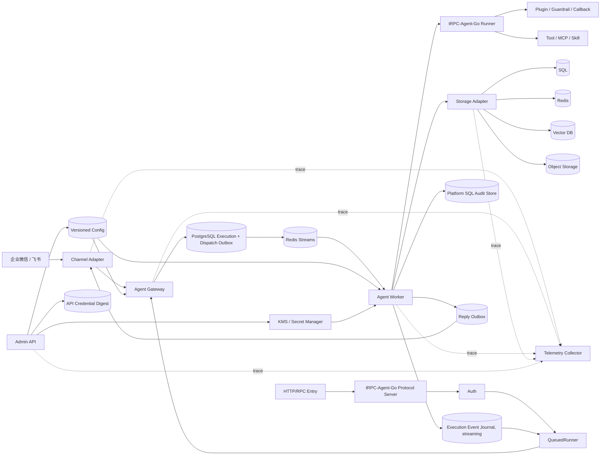

# 系统架构图与组件说明

## 1. 系统架构图

## 2. 组件职责

| 组件 | 职责 |
| --- | --- |
| Channel Adapter | 接收 IM 回调，完成验签、解密、标准消息转换；在 Gateway 事务提交后 ACK，并发送 IM 回复；通道提供已验证撤回事件时定位并取消未执行 Job |
| tRPC-Agent-Go `server/*` | 按产品启用对应协议；不直接持有真实 Runner |
| Auth / QueuedRunner | 从认证上下文取得可信 Tenant/App 和终端用户或服务主体；把协议 Run 转成 Gateway 入队；流式响应或断线恢复时从 Execution Event Journal 返回事件 |
| Agent Gateway | 在单个 PostgreSQL 事务中复核身份和状态、固定配置版本、处理幂等、分配 turn；IM 创建 Inbox/Execution/Dispatch Outbox，HTTP/RPC 创建 Execution/Dispatch Outbox |
| PostgreSQL Execution + Dispatch Outbox | 按 `tenant/app/session_principal/session` 保存顺序、最小可恢复状态和可靠发布记录 |
| Redis Streams + Session Lease | Relay 发布、Consumer Group 分发与 Pending 重领；Session Lease 串行 Runner |
| Agent Worker | 消费任务，条件认领 Execution，装配租户运行时，调用真实 Runner，消费 Event Channel 到关闭；流式入口写 Execution Event；按 `run_token` 更新 Execution 和必要 Audit |
| Storage Adapter | 根据租户后端配置选择 Session、Memory、Knowledge、Artifact 后端 |
| Platform SQL Audit Store | 保存可靠、追加型 Audit Event；`audit_policy` 只控制保留、脱敏和查询权限 |
| Admin API | 管理 Tenant、Agent App、API Credential、配置版本、Channel Binding、角色绑定、后端迁移、策略、灰度和回滚 |
| Secret Manager / KMS | 保存模型、IM、数据库和 Tool/MCP 等需要运行时取回的 Secret；平台配置只保存 `secret_ref` |
| Telemetry Collector | 汇聚 trace、metrics、脱敏日志和成本观测；不作为可靠 Audit Store |

## 3. 组件协作

IM 请求先进入 Channel Adapter。Adapter 完成验签、解密和标准化后交给 Agent Gateway；Gateway 在同一事务中写入 Inbox、Execution 和 Dispatch Outbox，提交成功后 Adapter 才 ACK 外部 IM。重复投递命中已有 Inbox 时不再创建 Execution，直接 ACK。按产品启用的 HTTP/RPC 请求复用相应 tRPC-Agent-Go `server/*`，认证后调用 QueuedRunner；经验证的用户 claims 生成用户身份，仅 API Key 的请求固定使用 Credential 服务主体，payload 不能覆盖用户或会话主体。QueuedRunner 只负责入队，流式入口再订阅持久化执行事件，真实 Runner 只存在于 Worker。

Gateway 的生产准入使用一个短事务：按固定顺序锁定并复核 Credential 或 Channel Binding、Tenant 和 Agent App，读取 active config version，处理请求幂等，锁定 Session lane 分配 `turn_seq`，同时创建 Execution 和 Dispatch Outbox。Execution 覆盖一条请求的最小可恢复生命周期，Runner 重试不创建第二条 Execution。配置切换、凭据撤销和租户状态更新取得相同权威行的冲突锁；权威后端变更只由 `data_migration` 的 `DRAINING`、`COPYING`、`VERIFYING` 流程切换。事务提交是准入线性化点，Execution 中的 `config_version` 后续不变。

Relay 将 PostgreSQL `dispatch_outbox` 发布到 Redis Streams，Worker 通过 Consumer Group 接收任务。执行前按配置版本加载模型、工具策略和数据后端配置，并通过 Storage Adapter 取得带租户作用域的 Session、Memory、Knowledge、Artifact 后端能力；Audit 始终写平台 SQL。Redis Session Lease 串行化同一 Session 的 Runner，PostgreSQL `run_token` 保护执行状态更新。本方案不为 Session Provider 实现旧 Worker 写入栅栏，Lease 丢失时取消 Runner 并排空事件通道；旧 Runner 的最后一次 Session 迟到写入是明确接受的残余风险。

Runner 通过 Worker 装配的 Session/Memory 后端写入 Event 和 Memory。Worker 持续消费 Event Channel 到关闭，负责可靠 Audit 和 telemetry 收口；启用流式协议入口时再写 Execution Event。IM 最终回复的 Outbox、Job/Execution 终态和必要 Audit 在平台 SQL 的同一条件事务写入，避免 Job 已完成但回复永远未入队。Execution Event Journal 把结果送回对应协议节点，Reply Sender 则把回复交给 Channel Adapter。

## 4. 部署形态

最小部署使用一个 `all` 角色服务进程、一个 PostgreSQL 数据库和一个 Redis 实例。逻辑上仍区分控制面、数据面、状态面、密钥面和观测面；PostgreSQL 承载配置、Credential digest、默认 PostgreSQL Session、Inbox、Execution Event、Reply Outbox 和 Audit，Redis 承载 Dispatch Stream、Consumer Group Pending 重领和 Session Lease。

生产部署建议拆分：

- 协议入口/Gateway、Worker、Channel Adapter、Admin API 独立部署，支持按流量分别扩缩容。
- PostgreSQL 默认承担准入、配置、Job 顺序和租约协调。
- Redis 在主链路承载 Dispatch Stream 和 Session Lease，也可承担缓存和限流；其部署必须满足原子性、恢复和迁移契约。
- SQL 承担配置、Inbox/Outbox、Audit 和 metadata，也是默认可选的 Session Provider；选中的 Session Provider 承担其 Event、State 和 Summary。
- 向量库承担 Memory/Knowledge 检索索引。
- 对象存储承担 Artifact、附件和知识库原文。
- Secret Manager/KMS 独立保存运行时 Secret，Worker 通过有作用域的 `secret_ref` 获取。
- Telemetry Collector 汇聚 trace、metrics、脱敏日志和成本数据；可靠 Audit 单独持久化。
