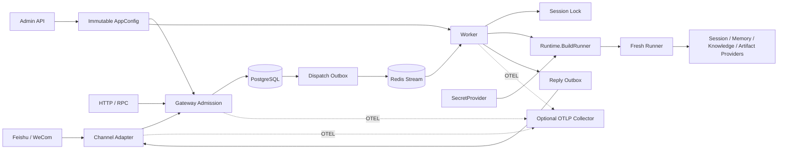

# 当前系统架构

## 组件关系



## 组件职责

| 组件 | 责任 |
| --- | --- |
| Channel Adapter | Feishu/WeCom 验签、解密、Binding/Identity 映射和文本收发 |
| Gateway | 可信 scope、配置版本、Inbox 幂等、turn_seq、Execution 和 Dispatch Outbox |
| Relay / Redis Stream | 将已提交 Dispatch Outbox 投递给任意 Worker |
| Worker | Claim Execution、持有 Lease、获取 Session Lock、运行 fresh Runner、排空 events 并关闭 Runner |
| Runtime | 按 pinned AppConfig 直接组装模型、Session、Memory、Artifact、Knowledge 和 Tool |
| PostgreSQL Store | 平台协调记录、metadata、Inbox/Outbox、Execution Lease 和 recall state |
| Session Provider | 维护共享 Session service；当前支持 PostgreSQL 和 Redis |
| Qdrant Provider | 以 tenant/app/config/knowledge-base scope 做 Knowledge retrieval |
| Artifact Provider | object storage + SQL metadata；按 ArtifactRef/version 恢复媒体 |
| Reply Sender | Claim Reply Outbox、校验 Binding Revision、发送普通文本并处理 transient retry |
| Admin API | 创建并发布 Tenant、App、Binding 和 immutable AppConfig |
| OTLP Collector（可选） | 接收服务标准 OTEL trace/metrics；无 endpoint 时服务使用无 exporter SDK provider，不属于 Audit Log 权威源 |

## 执行约束

1. Adapter 只有在 Gateway 事务提交 Inbox、Execution 和 Dispatch Outbox 后确认 callback。
2. Worker 只能使用 Execution 中固定的 `config_version`，不能读取新的 active version 替换它。
3. 同一 Session 的 `turn_seq`、Execution Lease 和 Redis Session Lock 分别保护顺序、状态所有权和串行执行。
4. Runner event channel 必须消费到关闭，再调用 `Runner.Close`；Context 取消不会跳过排空。
5. Queue、Session Event 和日志只保存 ArtifactRef，不保存媒体 bytes 或 Secret 原文。
6. Reply Outbox 发送前重新校验 Binding Revision，避免旧目标或错误 tenant/app 发送。

## 后端选择

```text
AppConfig.BackendConfig
→ Session: PostgreSQL / Redis Provider
→ Memory: configured Provider
→ Knowledge: Qdrant + SQL Catalog
→ Artifact: object storage + SQL metadata
```

后端切换使用 immutable config version 和 data migration gate。Qdrant 没有平台级导入
任务；Artifact 没有 durable cleanup recovery。异常补偿只在 metadata 写入失败时对刚
写入的对象执行 best-effort delete。
