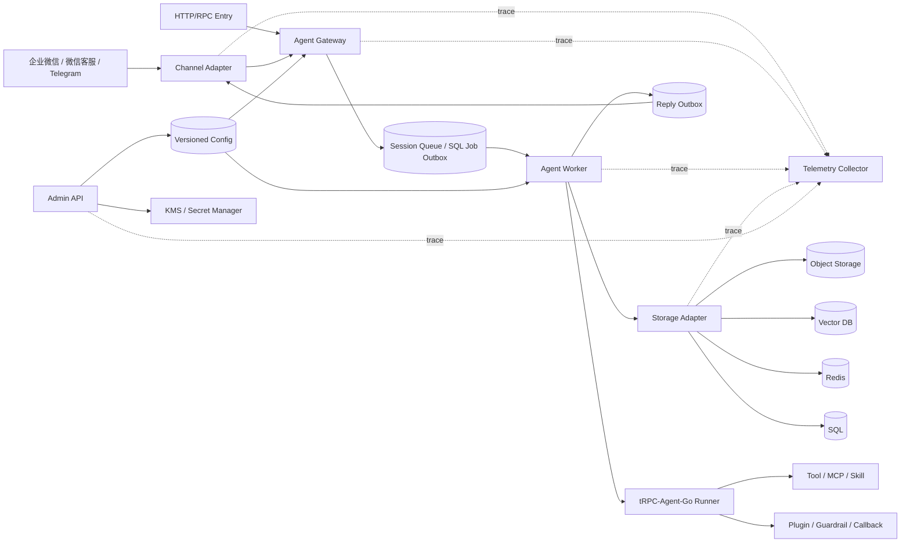

# 系统架构图与组件说明

## 1. 系统架构图

## 2. 组件职责

| 组件 | 职责 |
| --- | --- |
| Channel Adapter | 接收 IM webhook，完成验签、解密、去重、协议 ACK、标准消息转换和 IM 回复发送 |
| Agent Gateway | 认证、租户解析、应用解析、配置版本选择、请求幂等、附件检查和任务生成 |
| Session Queue / SQL Job Outbox | 按 `tenant/app/session` 组织任务，削峰并避免同一 Session 并发执行 |
| Agent Worker | 消费任务，装配租户运行时，调用 Runner，消费 Event Channel 到关闭，写 Reply Outbox |
| Storage Adapter | 根据租户后端配置选择 Session、Memory、Knowledge、Artifact、Audit 等后端 |
| Admin API | 管理 Tenant、Agent App、配置版本、Channel Binding、后端配置、策略、灰度和回滚 |
| Telemetry Collector | 汇聚 trace、metrics、日志、审计和成本数据 |

## 3. 组件协作

IM 请求先进入 Channel Adapter。Adapter 完成平台验签、去重和 ACK 后，把消息转成平台标准消息，再交给 Agent Gateway。HTTP/RPC 请求由协议入口解析认证信息和请求体后，也转成平台标准消息交给 Gateway。

Gateway 只负责把标准消息变成可执行任务。它解析 `tenant_id/app_id/config_version/session_id`，生成 `request_id` 和 `partition_key`，写入 Session Queue 或 SQL Job Outbox。

Worker 从队列或 SQL Job Outbox 拉取任务。执行前按配置版本加载模型、工具策略和数据后端配置，并通过 Storage Adapter 取得带租户作用域的 Session、Memory、Knowledge、Artifact、Audit 后端能力。

Runner 通过 Worker 装配的 Session/Memory 后端写入 Event 和 Memory。Worker 持续消费 Event Channel 到关闭，负责 execution、Reply Outbox 和 telemetry 收口。发送组件再把回复交给 Channel Adapter 或 HTTP/RPC 响应层。

## 4. 部署形态

最小部署可以使用一个服务进程和一个 SQL 数据库。SQL 同时承载配置、Session、Inbox、Job Outbox、Reply Outbox 和 Audit，便于先跑通完整链路。

生产部署建议拆分：

- Gateway、Worker、Channel Adapter、Admin API 独立部署，支持按流量分别扩缩容。
- Redis 承担队列、限流和缓存。
- SQL 承担配置、Session/Event、Inbox/Outbox、Audit 和 metadata。
- 向量库承担 Memory/Knowledge 检索索引。
- 对象存储承担 Artifact、附件和知识库原文。
- Telemetry Collector 汇聚 trace、metrics、日志和成本数据。
