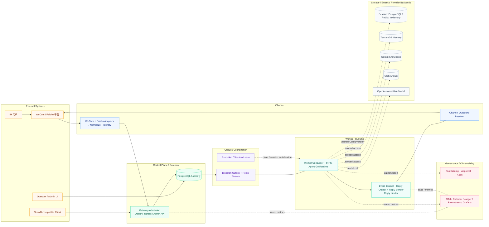

# 系统架构

本文只描述当前代码和部署文件中存在的组件。`Storage Adapter`、`Governance`、`Telemetry` 等是进程内模块或外部依赖，不额外虚构独立服务。

## 架构图

源文件：[system-architecture.mmd](diagrams/system-architecture.mmd)，查看版：[system-architecture.svg](diagrams/system-architecture.svg)。

## 部署边界和组件关系

| 层 | 真实组件 | 主要职责 | 是否持有业务状态 | 权威数据 | 水平扩展与故障行为 |
| --- | --- | --- | --- | --- | --- |
| 外部系统 | WeCom Bot、Feishu/Lark、OpenAI-compatible model、TencentDB Memory、Qdrant、COS | IM 输入/输出、模型、记忆、向量、对象 | 各自持有 Provider 数据 | 对应 Provider；但租户授权仍由平台 SQL 控制 | Provider 连接/限流/错误由 adapter/resolver 处理；真实 Provider 与部署行为已完成外部实测 |
| Channel | `wecom.Adapter`、`feishu.Adapter`、`channels/outbound.Resolver`、attachments ingestor | 官方长连接、规范化、binding revision、身份映射、媒体 staging、绑定级 `SendOnce` 客户端 | 进程内连接/客户端句柄；持久映射在 SQL | `channel_binding`、identity/conversation/inbox；发送状态在 `reply_outbox` | 每个 Gateway 进程会重连 active binding；Worker 的 outbound resolver 按 binding revision 创建客户端；当前部署需保持单一 channel owner |
| Control Plane | `admin` HTTP、`auth`、`config`、`postgres.Store` | 租户/app/config/credential/binding、Admin 查询、迁移命令 | 少量缓存无权威意义 | PostgreSQL `platform.*` | API 可多副本；PostgreSQL 不可用时 readiness/admission 失败 |
| Gateway | OpenAI Ingress、`gateway.Gateway`、Queued Runner、Admission | 认证、配置 pin、原子入队、durable event projection | 不持有 Runner/Session 内容 | PostgreSQL execution/event | HTTP 可横向扩展；请求可以到任意 Gateway，不依赖 sticky |
| Queue / Coordination | Redis Stream Consumer Group、dispatch relay、execution/session lease、reply limiter | durable outbox 后的传输、claim 协调、Session 串行、IM pacing | Redis pending/lease 是协调状态，不是 execution authority | execution 状态在 PostgreSQL | Redis 故障时 relay/consumer/backoff；pending 可 XAUTOCLAIM；Redis 不是最终事实 |
| Worker / Runtime | Consumer、Runtime、framework Runner/LLMAgent、ToolCatalog、Reply Sender、Migration/Cleanup | claim/fence、模型/工具/数据访问、持久事件、异步回复、迁移清理 | 运行中 goroutine/连接缓存；无业务权威状态 | PostgreSQL execution/event/outbox + 外部领域后端 | Worker 可加副本；claim/session lease/heartbeat 支持故障接管 |
| Storage | PostgreSQL、framework Session Redis/PostgreSQL/InMemory、Qdrant、COS、TencentDB resolver | 控制面、Session、Knowledge、Artifact、Memory | PostgreSQL 与 framework/Provider 各持领域状态 | 见[后端适配](backend-adaptation.md)；运行时由 resolver 按 ConfigVersion 选择 provider | framework/provider 故障按各自适配语义处理；最终 authority 与迁移边界见[后端适配](backend-adaptation.md) |
| Governance | ToolPolicy、Budget callback、Approval、audit | 工具可见/可执行、预算、二次确认、元数据审计 | Approval/audit 在 PostgreSQL | `tool_approval`、`audit_event` | 未知工具 fail closed；audit 是 best-effort，失败有指标，不写 raw payload |
| Observability | OTel SDK/Collector、Jaeger、Prometheus、Grafana、Operations API | trace、低基数 metrics、dashboard、运行摘要 | exporter/时序数据在外部 | 不是业务状态 authority | exporter 不可用回退 noop；不能阻断核心执行 |

## 关键边界

1. Gateway 的 Admission 是系统入口的原子边界；`execution` 插入成功前没有可消费的业务请求。
2. Redis Stream 只承载 `Dispatch{tenant_id, app_id, request_id, traceparent/tracestate}`；Worker 必须回 PostgreSQL 读取和 claim 精确 execution。
3. Runner 事件先写 `execution_event`，Queued Runner 从 durable event source 读取；HTTP stream 断开不会删除执行。
4. `reply_outbox` 把模型执行成功与 IM Provider 发送解耦；Provider receipt 不确定时保存 `UNCERTAIN`，不猜测发送结果。
5. Admin API 使用独立 bearer token 和 role/tenant allowlist；它不接受 data-plane API key 作为控制面权限。

## 运行角色

- `gateway`：HTTP ingress、Admin API、WeCom/Feishu adapter、dispatch relay。
- `worker`：HTTP health/readiness、consumer、Runner、Reply Sender、migration、artifact cleanup、heartbeat。
- `all`：本地或简单部署的组合角色；生产推荐拆分，避免 ingress、长连接和执行资源互相争抢。

Kubernetes 当前只部署 Gateway/Worker 两类 Deployment；Admin UI 只在 Compose 中作为 Nginx 容器提供。所有角色启动时连接并校验 PostgreSQL/Redis，进程运行 migrations；Worker 另依赖 Qdrant（当配置对应 Backend 时还需 COS/TencentDB endpoint）。
